# Histopathologic Cancer Detection

### Problem Statement
This project aims to develop a deep learning algorithm to identify metastatic cancer in small image patches taken from larger whole-slide images. The algorithm is trained on a set of labeled images, and evaluated on a test set.   Each training image patch is labeled 1 if it has tumor and 0 if not. Given an image patch, the algorithm predicts tumor probability.

### Datasets and Inputs
The dataset comes from a [Kaggle competition](https://www.kaggle.com/c/histopathologic-cancer-detection/data). It has 220,026 pathology images in the training set and 57,459 pathology images in the test set.  Each image in the training set is labeled with 1 or 0. The label 1 indicates that the center 32x32px region of an image contains at least one pixel of tumor tissue.

### Metrics
In this Kaggle competition, solution models are evaluated on area under the ROC curve between the predicted probability and the observed target on the test set. The ROC curve is a plot of True Positive Rate against False Positive Rate as the threshold probability dividing the positive and negative varies.   The area under the ROC curve (AUC-ROC) represents the performance of a solution model.  An excellent model has the area under the ROC curve close to 1. When the area under the ROC curve is 0.5, the model has no classification capability.  When the area under the ROC curve is close to 0, the model predicts the opposite of the ground truth.

### Exploratory Data Analysis
The implementation for data exploration is in [exploratory_data_analysis](exploratory-data-analysis.ipynb).

#### 1. Sample images

The training and test images are of size 96x96px.  Each of the training images is labeled according to whether there is at least one pixel of tumor tissue in the center region (32x32px).  Each of the boxes in the following figure denotes the center region. Tumor tissue outside this center region does not influence the label. Therefore, a negatively labeled image may contain tumor pixels in the outer region.  This may make our training hard.

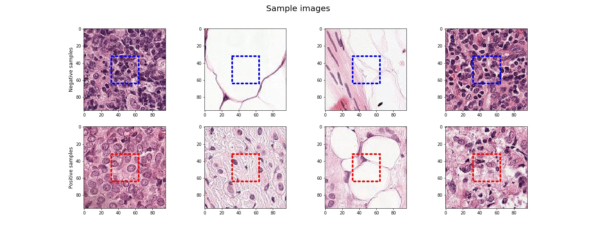

From the samples shown above, one can tell it is hard to distinguish a positive sample from a negative one for an untrained person.

#### 2. 	Data statistics
The following figure shows the data distribution for the training set. It has about 130k negatively and 90k positively labeled images.  The ratio is closer to 60/40 meaning that there are 1.5 more negatives than positives. The mean pixel value (RGB) of the training images (normalized to 0~1) is [0.7024, 0.5462, 0.6965], and the standard deviation is [0.2389, 0.2821, 0.2163].
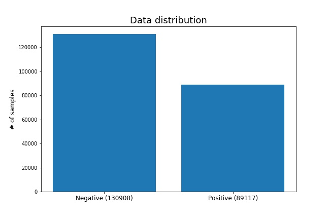

#### 3.	Outliers
There is one extremely dark image with all pixel values less than 10 and six extremely bright images with all pixel values greater than 245.  These images are all labelled negative. There may be no tissue in these images.  

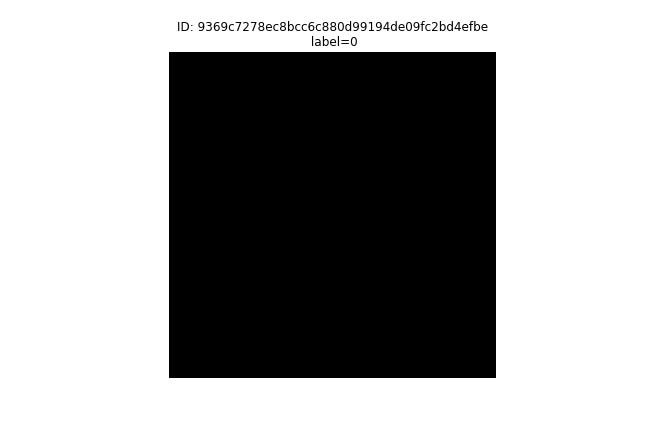

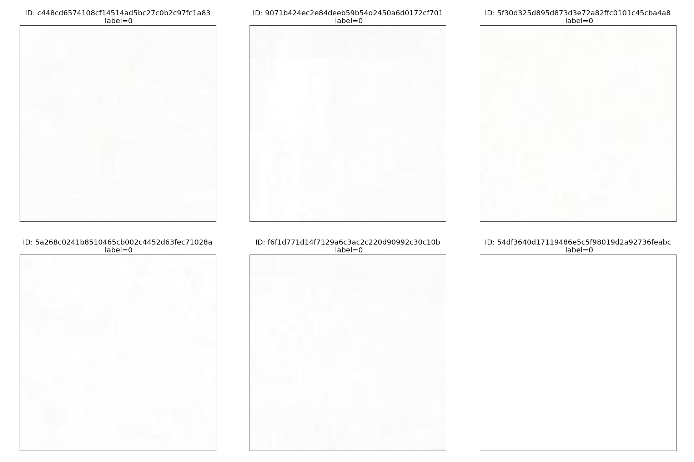

#### 4. Exploratory Visualization
Due to limited RAM, a subset of training images (20k samples) is used for the exploratory visualization. The following figure shows the mean image brightness distribution for positive and negative samples, separately.  For the positive samples, the distribution looks like a normal distribution around a brightness of 150, while the distribution for the negative samples looks like a bimodal distribution with peaks around 135 and 225.  This difference may be implicitly used in our following deep learning model to identify positive and negative images.

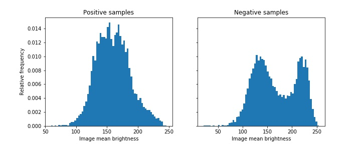

### Algorithms and Techniques
Convolutional neural networks are well suited for this binary image classification problem.  A convolutional neural network consists of an input and an output layer, as well as multiple hidden layers. For this problem, the input layer handles the input image, and the output layer uses a sigmoid function to give the tumor probability of the input image.  The hidden layers consist of a cascade of convolutional layers, pooling layers, fully connected layers and dropout layers.  The convolutional and full connected layers identify features from the input images and do the classification. The pooling and dropout layers combat overfitting.

Passing the entire dataset to the neural network for training is not feasible.  We need to divide our dataset into numbers of batches.  Training the neural network with only one epoch may not be enough.  We need a number of epochs to combat underfitting.  If the number of epochs is too large, we may overfit the data.  An optimal number of epochs can be identified when the validation loss stops improving.  Learning rate is another parameter that affects training.  It controls how much our model learns from a training batch.  If the learning rate is low, the training is more reliable, but it takes a lot of time for training. If the learning rate is high, the training may not converge.

### Benchmark
The benchmark model is a trained CNN from the [Kaggle kernel](https://www.kaggle.com/gomezp/complete-beginner-s-guide-eda-keras-lb-0-93).  Kaggle splits the test data set into public and private. Running the benchmark kernel gives an AUC-ROC score of 0.8749 for the public test set and 0.8890 for the private test set.


###	Methodology
#### 1.  Data Preprocessing
Training a convolutional neural network for the image classification does not require any manual feature selection or feature transformation. The neural network itself identifies features for classification.  Instead, we do data augmentations to improve the training dataset. The techniques used in this work are random rotation, random translation, random brightness, random contrast, and flip images (horizontally and vertically).  There are seven outliers out of the 220k training images.  I tried training with and without these seven outliers.  I will report the training with outliers first, and discuss the influence of these outliers later.
The training dataset is split into a training set (80%) and a validation set (20%).

#### 2. Implementation
Three different deep learning models are implemented.  The first one is a CNN from scratch.  The implementation is in the [notebook](cnn_from_scratch.ipynb). The CNN has five convolutional layers, one fully-connected layer and one output layer.  Each convolutional layer is followed by a batch normalization layer, a relu activation layer, and a pooling layer.  The fully-connected layer is followed by a batch normalization layer, a relu activation layer, and a dropout layer.  The final output layer uses a sigmoid activation to give the tumor probability.  The CNN architecture is shown below.

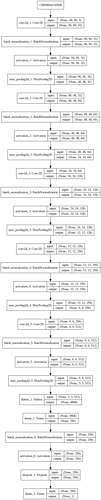

Since we have a large number of images, importing all of them into RAM at once is memory-inefficient. Instead, we implement a python generator which allows us to pull pieces of the data and process them on the fly only when needing them.
The [second model](resnet50_tl.ipynb) and [third model](densenet169_tl.ipynb) are transfer learning of the Resnet-50 and Densenet-169 architectures, respectively.  The [FastAI library](https://docs.fast.ai/) is used, and it makes the coding much easier. For example, we can specify a transfer learning model with just one line of code as below.

```
learner = cnn_learner(data, resnet50, pretrained = True, path='.',
                      metrics = [accuracy, auc_score], ps=0.5)
```

The training is easier as well.  We do not need to randomly specify a learning rate. Instead, the FastAI library has a function “lr_find”, which helps us identify a proper learning rate.  The following figure shows a plot of the losses against learning rates, which is an output from the FastAI “lr_find” function. The loss reaches a minimum at a learning rate around 7e-2.  We pick a learning rate of 2e-2, which is a bit before the minimum.

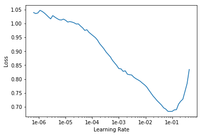

We could train the model with just one line of code as below
```
learner.fit_one_cycle(8, 2e-2)
```
This means 8 epochs are specified for training, and the maximum learning rate is 2e-2. The following figure shows the learning rate in a training process.

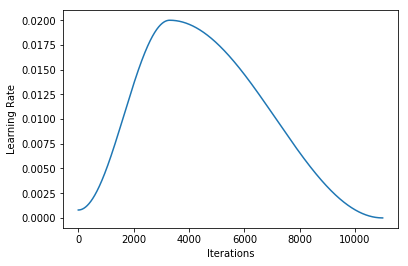

When starting training, a lower learning rate is used to warm up. Then the learning rate goes up to the maximum 2e-2.  The high learning rates prevent the model to land in a local minimum. High learning rates, however, may make the validation loss spike, as shown in the following figure. The learning rates descend to a small value at the end of the training to smooth the validation loss.

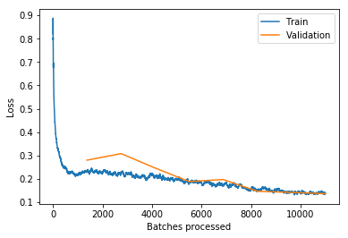

FastAI allows test time augmentation when predicting the labels of new datasets with one line of code as below
```
preds_test,y_test=learner.TTA(ds_type=DatasetType.Test)
```
The data augmentation for training can give a better model. The test time augmentation is believed to improve prediction accuracy because it predicts the tumor probability for the original test image along with several random transforms of the same image and take an average of these predictions to determine the final tumor probability.

#### 3. Refinement
The training and validation AUC-ROC scores for the CNN model from scratch are 0.9781 and 0.9738, respectively.  Kaggle splits the test data set into public and private. This model gives a score of 0.9503 for the public test set and 0.8981 for the private test set.

The Resnet50 transfer learning model gives an AUC-ROC score of 0.9885 for the validation set.  The score for the public and private test sets are 0.9649 and 0.9572, respectively.

The Densenet169 transfer learning model has a validation AUC-ROC score of 0.9904. The score for the public and private test sets are 0.9617 and 0.9628, respectively.

Since the CNN model from scratch gives lower test scores than the two transfer learning models, I only refine the two transfer learning models to get higher test scores.

In our first training of the Resnet50 and Densenet169 models, we train only the heads while keeping the rest of the models frozen. After the heads are trained, the models already perform well on the test dataset, as shown above.  To refine the models, we unfreeze all the trainable parameters and continue its training.  The learning rate in the finetuning is much smaller than that for the first training because we do not want to mess up with the well-trained weights in our first training.

After finetuning, the Resnet50 transfer learning model achieves a higher AUC-ROC score of 0.9930 for the validation set than before, but it gives lower scores of 0.9636 for the public test set and 0.9551 for the private test set.
The Densenet169 transfer learning model, after finetuning, achieves a higher AUC-ROC score of 0.9930 for the validation set than before. Its public test score has a tiny increase from 0.9617 to 0.9621, while its private test score decreases from 0.9628 to 0.9562.

The finetuning does not improve our test scores for either of the Resnet50 and Densenet169 transfer learning models because they already have had a high performance before the finetuning.


#### 4. Influence of Outliers
We implemented [CNN model from scratch](cnn_from_scratch_without_outliers.ipynb), [Resnet50](resnet50_tl_without_outliers.ipynb), and [Densenet169](densenet169_tl_without_outliers.ipynb) with outliers removed. The final results for the three models with and without outliers are shown in the following table.

| Model                               | Validation score | Public test score | Private test score |
|-------------------------------------|------------------|-------------------|--------------------|
| CNN from scratch (with outliers)    | 0.9738           | 0.9503            | 0.8981             |
| CNN from scratch (without outliers) | 0.9004           | 0.8319            | 0.8964             |
| Resnet50 (with outliers)            | 0.9930           | 0.9636            | 0.9551             |
| Resnet50 (without outliers)         | 0.9927           | 0.9680            | 0.9487             |
| Densenet169 (with outliers)         | 0.9930           | 0.9621            | 0.9562             |
| Densenet169 (without outliers)      | 0.9926           | 0.9640            | 0.9594             |

 The CNN model from scratch has a poorer performance when the outliers are removed, while the two transfer learning models are insensitive to the outliers.   The pre-trained transfer learning models may have learned the features in the outliers, but the model from scratch are not able to learn them when the outliers are removed.  In what follows, I only discuss the models trained with outliers included.

### Results

#### 1. Model Evaluation and Validation
Both of the Resnet50 and Densenet169 models (before and after finetuning) perform better than the CNN model from scratch on the public and private test sets. The Densenet169 model before the finetuning has the highest score for the private test set, which is harder than the public test set. We use it as our final model.

Deep learning models act like a black box.  It is hard to evaluate its parameters or weights.  Instead, we evaluate our final deep learning model by its performance on new datasets. The public and private test sets are totally unseen by the final model.  The final model gives an AUC-ROC score of 0.9617 for the public test set and 0.9628 for the private test set, indicating that the model generates well to unseen data.

The final model is robust for small perturbations in training data. In the data preprocessing, we do data augmentation, which takes image perturbations into account. Therefore, the final model should be insensitive to image perturbations.

The final model has a high performance, but it is not perfect. It makes mistakes on a small number of validation images, as the confusion matrix in the following figure shows.  Therefore, one cannot fully trust the model. Instead, this model can be used to assist a human pathologist for tumor detection.


#### 2. Justification
The benchmark model gives an AUC-ROC score of 0.8749 for the public test set and 0.8890 for the private test set. Our final model results in a public score of 0.9617 and a private score of 0.9628.  In addition, the benchmark model gives a validation accuracy of 0.8226, while the validation accuracy for our final model is 0.9593.  It is obvious that our final results are stronger than the benchmark results.

A plot of the ROC curve for our final model on the validation set is shown below.  The area under the ROC curve is close to 1, indicating a high performance of the model on the validation set.
The final model has a high performance on the unseen test sets, indicating that it generates well to new data.  Therefore, our final solution has solved the problem.

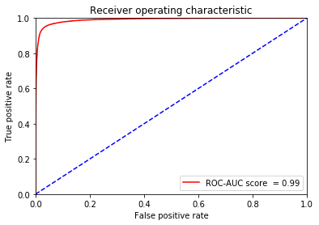


###	Conclusion
#### 1. Free-Form Visualization
The following figure shows the most incorrect and correct samples from the validation set for the Densenet169 model after finetuning. The most incorrect samples help us understand what the model is struggling with. The most correct samples help us understand what the model is good at. If a human pathologist has a good performance on the most incorrect samples but has a poor performance on the most correct samples, the pathologist can make an improvement on tumor detection with the assistance of the model.

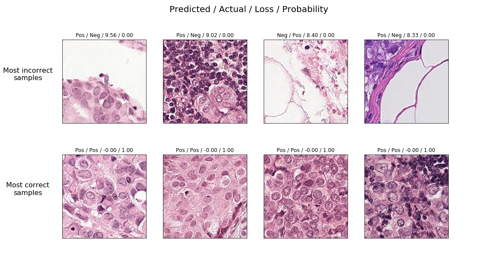


#### 2. Reflection
In this project, I explore the training dataset at first, which includes looking at sample images, understanding the distribution of training labels, identifying outliers, and visualizing features of the training data. Second, I do data augmentations such as random rotation, random translation, random brightness, random contrast, and flip images (horizontally and vertically) to improve the training dataset.  Third, I train three deep learning models including one CNN model from scratch and two transfer learning models (i.e., Resnet50 and Densenet169). Fourth, I finetune the two transfer learning models. At last, I examined the influence of the outliers on the performance of the three models.

#### 3. Improvement
I use a fixed learning rate for the training of the CNN model from scratch.  A better approach is to specify a varying learning rate along the training as implemented by FastAI.

Other transfer learning models such as Inception-v3 and VGG-19 may give better solutions than our final Densenet169 model. An ensemble of different models may result in higher AUC-ROC scores on the public and private test sets.


### Acknowledgement

The following two Kaggle kernels helps me a lot on this project.
1.	https://www.kaggle.com/qitvision/a-complete-ml-pipeline-fast-ai
2.	https://www.kaggle.com/gomezp/complete-beginner-s-guide-eda-keras-lb-0-93


### Software
* Python3
* Jupyter notebook

### Libraries
* numpy
* pandas
* matplotlib
* os
* cv2
* scipy
* sklearn
* random
* tqdm
* glob
* keras
* fastai
